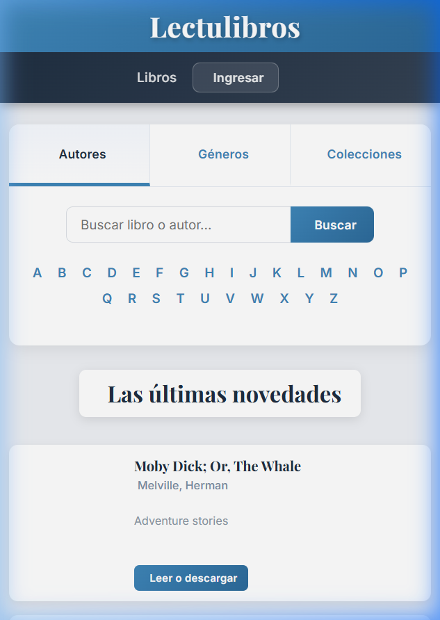

# 📚 Lectulibros

Una aplicación web para explorar y descubrir miles de libros gratuitos utilizando la API pública de [Gutendex](https://gutendex.com/), basada en el proyecto [Project Gutenberg](https://www.gutenberg.org/).

---

## 🖼️ Vista previa



---

## ✨ Funcionalidades

| Funcionalidad | Descripción |
|---|---|
| 📖 **Novedades** | Carga automática de los libros más populares al abrir la app |
| 🔍 **Búsqueda** | Buscar por título o autor desde la barra de texto |
| 🔤 **Abecedario** | Filtrar autores, géneros o colecciones por letra inicial |
| 👤 **Autores** | Explorar libros filtrando por inicial del apellido del autor |
| 🏷️ **Géneros** | Seleccioná un género literario (aventura, ciencia ficción, romance, etc.) |
| 📂 **Colecciones** | Explorá colecciones curadas (Classic Literature, Gothic Fiction, etc.) |
| ⬇️ **Leer / Descargar** | Enlace directo a la versión HTML, EPUB o texto plano de cada libro |
| ➕ **Cargar más** | Paginación progresiva sin recargar la página |
| 🔐 **Modal Ingresar** | Ventana de login demo (sin backend) con animaciones suaves |

---

## 🛠️ Tecnologías

- **HTML5** — estructura semántica
- **CSS3** — diseño responsivo con variables, transiciones y animaciones
- **JavaScript (ES6+)** — fetch API, DOM manipulation, eventos
- **[Gutendex API](https://gutendex.com/)** — API REST pública de libros de Project Gutenberg
- **[Google Fonts](https://fonts.google.com/)** — Inter (UI) + Playfair Display (títulos)
- **[Font Awesome 6](https://fontawesome.com/)** — iconografía

---

## 🚀 Cómo usar

1. Cloná o descargá el repositorio.
2. Abrí `index.html` en tu navegador (no requiere servidor).
   > 💡 Para una mejor experiencia con la API, usá una extensión como **Live Server** en VS Code.
3. Explorá libros por autor, género o colección.

```bash
# Con Live Server (VS Code)
# Clic derecho en index.html → "Open with Live Server"
```

---

## 📂 Estructura del proyecto

```
📁 TP-2-Página-con-API/
├── 📄 index.html          # Estructura principal de la app
├── 📄 README.md           # Este archivo
├── 📁 css/
│   └── 📄 styles.css      # Estilos globales y responsivos
├── 📁 js/
│   └── 📄 libros.js       # Lógica de la app (fetch, filtros, UI)
└── 📁 img/
    └── 🖼️ portada-no-disponible.png
```

---

## 🎨 Diseño

- Paleta de colores: azul petróleo `#1e2d40` + azul acero `#3f86b9`
- Tipografía: **Inter** para UI, **Playfair Display** para títulos
- Efectos: tarjetas con `translateY` al hover, botones con glow, animación de carga en ícono
- Modal con backdrop blur y animación de entrada (`slideUp`)
- Diseño responsivo: desktop → tablet → mobile

---

## 🌐 API utilizada

**Gutendex** — `https://gutendex.com/books/`

| Parámetro | Uso |
|---|---|
| `?sort=popular` | Libros más populares |
| `?search=término` | Búsqueda por título o autor |
| `?topic=género` | Filtrar por tema / género / colección |

---

## 📝 Créditos

- API: [Gutendex](https://gutendex.com/) / [Project Gutenberg](https://www.gutenberg.org/)
- Iconos: [Font Awesome](https://fontawesome.com/)
- Fuentes: [Google Fonts](https://fonts.google.com/)
- Proyecto académico — Trabajo Práctico N°2
